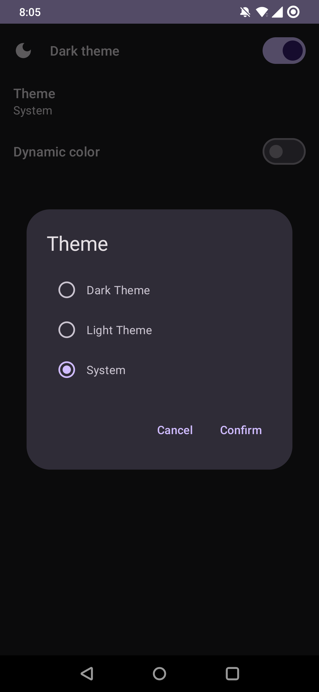

# Compose Preferences

(in progress)



<details>
<summary>Full example</summary>

```kotlin
class MainActivity : ComponentActivity() {
    override fun onCreate(savedInstanceState: Bundle?) {
        super.onCreate(savedInstanceState)
        setContent {
            DataStoreProvider {
                ComposePreferencesTheme(
                    darkTheme = Settings.darkTheme.value ?: return@DataStoreProvider,
                    dynamicColor = Settings.dynamicColor.value ?: return@DataStoreProvider
                ) {
                    Surface(
                        modifier = Modifier.fillMaxSize(),
                        color = MaterialTheme.colorScheme.background
                    ) {
                        Screen()
                    }
                }
            }
        }
    }
}

object Settings {
    val darkTheme = DarkThemePreference()
    val dynamicColor = DynamicColorPreference()
}

@Composable
fun Screen() {
    PreferenceScreen {
        item {
            SwitchPreference(
                title = { Text(text = "Dark theme") },
                preference = Settings.darkTheme,
                icon = {
                    Icon(
                        imageVector = if (Settings.darkTheme.value == true) {
                            Icons.Default.DarkMode
                        } else {
                            Icons.Default.LightMode
                        },
                        contentDescription = null
                    )
                }
            )

            val choices = listOf(
                Choice(true, "Dark Theme"),
                Choice(false, "Light Theme"),
                Choice(null, "System")
            )

            ListPreference(title = "Theme", preference = Settings.darkTheme.toActual(), choices = choices)

            SwitchPreference(
                title = { Text(text = "Dynamic color") },
                preference = Settings.dynamicColor.hideIfNotSupported()
            )
        }
    }
}
```

</details>

## Usage

### Step 1 - Provide a DataStore

```kotlin
setContent {
    DataStoreProvider { // preferencesDataStore(name = "settings")
        AppTheme {
            // ...
        }
    }
}
```

### Step 2 - Define preferences

```kotlin
val show = BooleanPreference("show") // defaultValue = false
```

A `Preference` has methods that rely on `LocalDataStore.current`. It can also be used in a [view model](https://youtu.be/fSB6_KE95bU?si=BsrZPqZDV4IAx8i5) where a datastore is injected.

### Step 3 - Read the preference

```kotlin
    val preference = BooleanPreference("show", true)
    val show = preference.value ?: return // null initially

    Text(text = "Show: $show")

    // or ...
    var state by preference.state()

    Switch(checked = state ?: return, onCheckedChange = { state = it})
```

<details>
  <summary>This won't break previews.</summary>

```kotlin
val inPreviewMode
    @Composable
    get() = LocalInspectionMode.current

@Composable
fun <V> Preference<V>.state(): MutableState<V?> {
  // for previews
  if(inPreviewMode){
      val defaultValue = previewDefaultValue
      return remember {
          mutableStateOf(defaultValue) // doesn't read from datastore
      }
  }

  val currentValue = value
  val setValue = setValue()

  return object : MutableState<V?> {
      override var value: V?
          get() = currentValue
          set(value) = setValue(value)

      override fun component1(): V? {
          return value
      }

      override fun component2(): (V?) -> Unit = {
          value = it
      }
  }
}
```

</details>

### Step 4 - Add a PreferenceScreen

```kotlin
PreferenceScreen {
    item {
        Header(title = "General")
        SwitchPreference(
            title = "Dark theme",
            preference = darkThemePreference
        )
        SwitchPreference(
            title = { Text(text = "Dark theme") },
            description = { Text(text = "Change theme") },
            checked = darkThemePreference.value ?: return@item,
            onCheckedChange = darkThemePreference.setValue()
        )
        Divider()
    }


    item {
        Header(title = "Contact")
        PreferenceItem(
            title = "Send feedback",
            icon = {
                Icon(
                    imageVector = Icons.Default.Send, contentDescription = null
                )
            },
            onClick = {}
        )
    }

    item {
        Spacing()
        Header(title = "Privacy")
        PreferenceItem(
            title = { Text("Privacy policy") },
            onClick = {},
            action = {
                Icon(imageVector = Icons.Default.OpenInNew, contentDescription = null)
            }
        )
    }
}
```

## Behind the scenes

A `Preference` is simply an interface with a `flow` and `edit` method.

```kotlin
interface Preference<V> {

    fun flow(dataStore: DataStore<Preferences>): Flow<V?>
    suspend fun edit(dataStore: DataStore<Preferences>, transform: (currentValue: V?) -> V?)

    val value: V?
        @Composable
        get() {
            if (inPreviewMode) {
                return previewDefaultValue
            }
            return flow(LocalDataStore.current)
                .collectAsStateWithLifecycle(initialValue = null)
                .value
        }

    @Composable
    fun setValue(): (newValue: V?) -> Unit {
        if (inPreviewMode) {
            return {}
        }

        val scope = rememberCoroutineScope()
        val dataStore = LocalDataStore.current
        return { newValue ->
            scope.launch {
                edit(dataStore) {
                    newValue
                }
            }
        }
    }

    @get:Composable
    val previewDefaultValue: V?
}
```

To distinguish between `collectAsStateWithLifecycle(initialValue = null)` and `dataStore.data.map { preferences -> preferences[key] }` returning `null`, there is a `Result` class.

```kotlin
fun flowResult(dataStore: DataStore<Preferences>) = flow(dataStore).map { Result.Loaded(it) }

val result: Result<V?>
    @Composable
    get() {
        if (inPreviewMode) {
            return Result.Loaded(previewDefaultValue)
        }
        return flowResult(LocalDataStore.current)
            .collectAsStateWithLifecycle(initialValue = Result.Loading)
            .value
    }
```

When the `Context` is needed, override the `@Composable` functions.

```kotlin
class DarkThemePreference(
    name: String = "dark_theme",
) : SingleKeyPreference<Boolean>(booleanPreferencesKey(name)) {

    override val value: Boolean?
        @Composable
        get() = when (val result = result) {
            is Result.Loaded -> result.value ?: isSystemInDarkTheme()
            Result.Loading -> null
        }

    override val previewDefaultValue: Boolean
        @Composable
        get() = isSystemInDarkTheme()
}
```

## Download

For now, you can clone the repository and add a module to your project in `settings.gradle`:

```kotlin
include(":compose-preferences")
project(":compose-preferences").projectDir = File("repoPath/compose-preferences")
```

Then, add the module to your app in `build.gradle`:

```kotlin
implementation(project(mapOf("path" to ":compose-preferences")))
implementation("androidx.datastore:datastore-preferences:1.0.0")
```

## References

[ComposePrefs3](https://github.com/JamalMulla/ComposePrefs3/tree/master)

[CompositionLocal](https://developer.android.com/jetpack/compose/compositionlocal)

[DataStore](https://developer.android.com/topic/libraries/architecture/datastore)
